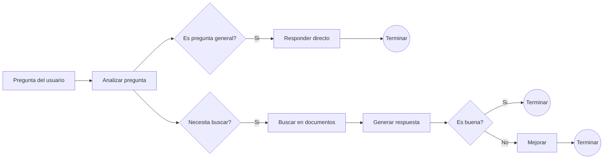
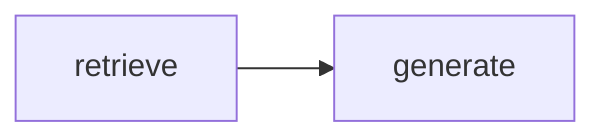
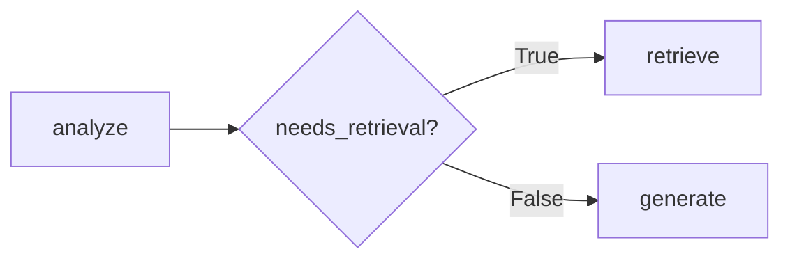

# LangGraph

Es una libreria de desarrollo que permite construir sistemas de IA con flujos ciclicos, decisiones condicionales y estado compartido.

Creado por el equipo de LangChain y lanzado en 2024, ahora es el estandar de la industria para construir agentes y sistemas complejos de IA.

## Flujo de ejemplo

El siguiente agente analiza la pregunta del usuario y decide si puede responder directamente o si necesita consultar documentos. Cuando genera una respuesta basada en documentos, la evalua y la mejora si no es suficientemente buena.



### Como se ejecuta

1. `Pregunta del usuario` inicia el estado del grafo.
2. `Analizar pregunta` clasifica la consulta.
3. Si es una pregunta general, el agente responde directamente y termina.
4. Si necesita contexto, busca en los documentos y genera una respuesta.
5. La respuesta se evalua: si es buena, termina; si no, pasa por `Mejorar` antes de terminar.
Este flujo muestra las piezas principales de LangGraph: nodos que ejecutan tareas, edges que conectan pasos, decisiones condicionales y un estado compartido durante toda la ejecucion.

## Conceptos fundamentales

### State

Es un diccionario tipado que viaja por todo el sistema. Cada nodo puede leer cualquier campo del estado y escribir solo los campos que le corresponden.

```python
from typing import Annotated, TypedDict

from langgraph.graph import add_messages


class RAGAgentState(TypedDict):
messages: Annotated[list, add_messages]
question: str
retrieved_docs: list[str]
response: str
needs_retrieval: bool
sources: list[dict]
```

En este ejemplo:

- `messages` conserva el historial de la conversacion y usa `add_messages` para combinar nuevos mensajes.
- `question` contiene la pregunta actual del usuario.
- `retrieved_docs` almacena los documentos recuperados para generar la respuesta.
- `response` contiene la respuesta generada por el agente.
- `needs_retrieval` indica si es necesario buscar informacion adicional.
- `sources` guarda las fuentes utilizadas para construir la respuesta.

### Node

Un nodo es simplemente una funcion que recibe el estado completo y devuelve un diccionario con solo los campos que modifica. Es la unidad de trabajo del sistema.

```python
def node_retrieve(state: RAGAgentState) -> dict:
# Lee del estado
question = state["question"]

# Hace su trabajo especifico
docs = buscar_en_chromadb(question)

# Devuelve solo lo que cambio
return {
    "retrieved_docs": docs,
    "sources": extraer_metadatos(docs),
}
```

El nodo lee `question`, busca los documentos relevantes y actualiza unicamente `retrieved_docs` y `sources`. LangGraph combina estos valores con el resto del estado y los entrega al siguiente nodo.

En la implementacion del proyecto, `buscar_en_chromadb` se reemplaza por el retriever de ChromaDB que recibe `node_retrieve` mediante el argumento `vectorstore`.

### Edge (Arista)

Una arista es la conexion entre nodos, existen dos tipos:

- Edge normal
- Edge condicional

### Edge normal

Una arista normal conecta un nodo con otro sin evaluar ninguna condicion. Cada vez que termina `retrieve`, el grafo continua siempre hacia `generate`.

```python
builder.add_edge("retrieve", "generate")
```

En este caso, el flujo es:



### Edge condicional

Una arista condicional utiliza una funcion para decidir el siguiente nodo basandose en el estado actual.

```python
from typing import Literal


def decide_retrieval_path(state: RAGAgentState) -> Literal["retrieve", "generate"]:
    if state.get("needs_retrieval", True):
        return "retrieve"
    return "generate"


builder.add_conditional_edges(
    "analyze",
    decide_retrieval_path,
    {
        "retrieve": "retrieve",
        "generate": "generate",
    },
)
```

La funcion devuelve una clave y el diccionario indica a que nodo corresponde cada resultado:



### StateGraph

Es el constructor del grafo. Le dices que estado usa, agregas nodos y aristas y llamas a `.compile()` para obtener el objeto ejecutable.

```python
from langgraph.graph import END, START, StateGraph


builder = StateGraph(RAGAgentState)

# Registrar los nodos
builder.add_node("analyze", node_analyze)
builder.add_node("retrieve", node_retrieve)
builder.add_node("generate", node_generate)

# Conectar el flujo
builder.add_edge(START, "analyze")
builder.add_conditional_edges(
    "analyze",
    decide_retrieval_path,
    {
        "retrieve": "retrieve",
        "generate": "generate",
    },
)
builder.add_edge("retrieve", "generate")
builder.add_edge("generate", END)

# Compilar el grafo para hacerlo ejecutable
agent = builder.compile()

# Ejecutar el agente con un estado inicial
initial_state = {
    "messages": [],
    "question": "Que documentos necesito para solicitar vacaciones?",
    "retrieved_docs": [],
    "response": "",
    "needs_retrieval": True,
    "sources": [],
}
result = agent.invoke(initial_state)
```

En el proyecto, `node_retrieve` recibe tambien un `vectorstore`. Por eso, antes de registrarlo, se puede crear una version parcial de la funcion con el almacén vectorial ya configurado.

## LCEL vs LangGraph

| LCEL | LangGraph |
| --- | --- |
| Mantiene el mismo flujo de principio a fin. | El flujo cambia segun el contexto. |
| No necesita tomar decisiones. | Necesita decidir entre multiples caminos. |
| No necesita repetir pasos. | Puede repetir pasos hasta que algo sea correcto. |
| Tareas simples: prompt -> LLM -> respuesta. | Sistemas que pueden evaluar y corregir su propia respuesta. |

En resumen, LCEL es adecuado para cadenas lineales y predecibles. LangGraph es mejor cuando el sistema necesita estado, decisiones condicionales, ciclos o varios caminos de ejecucion.

## Conclusion

Es la herramienta que convierte llamadas aisladas a un LLM en sistems de IA que toman decisiones, se repiten y se corrigen como lo haria un humano
